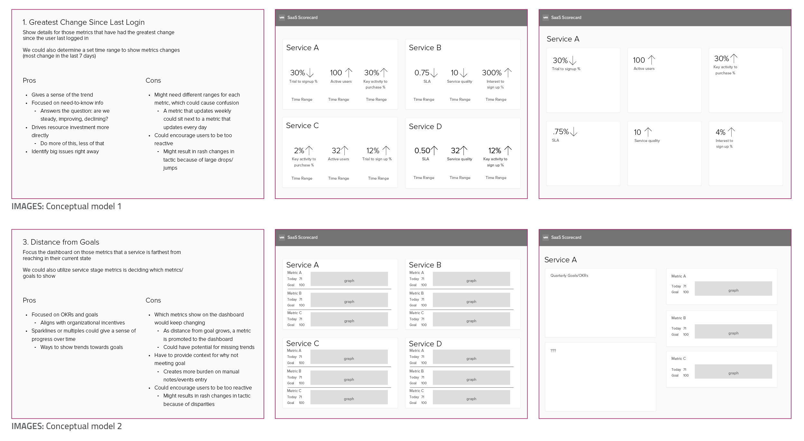
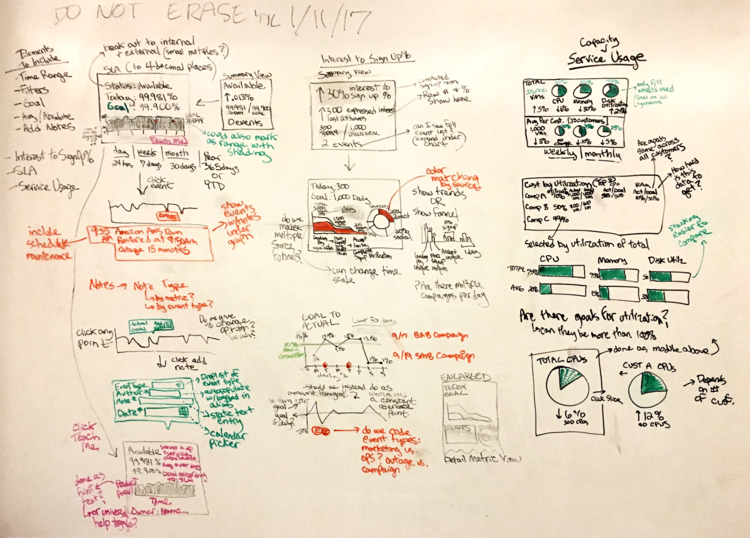
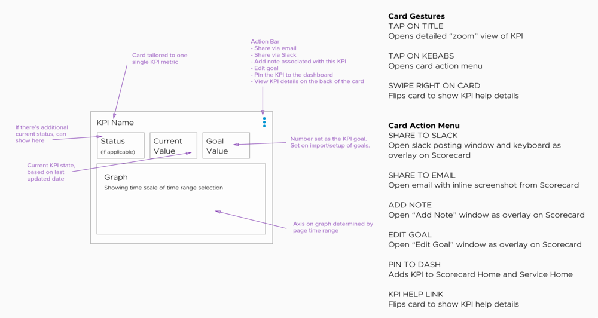
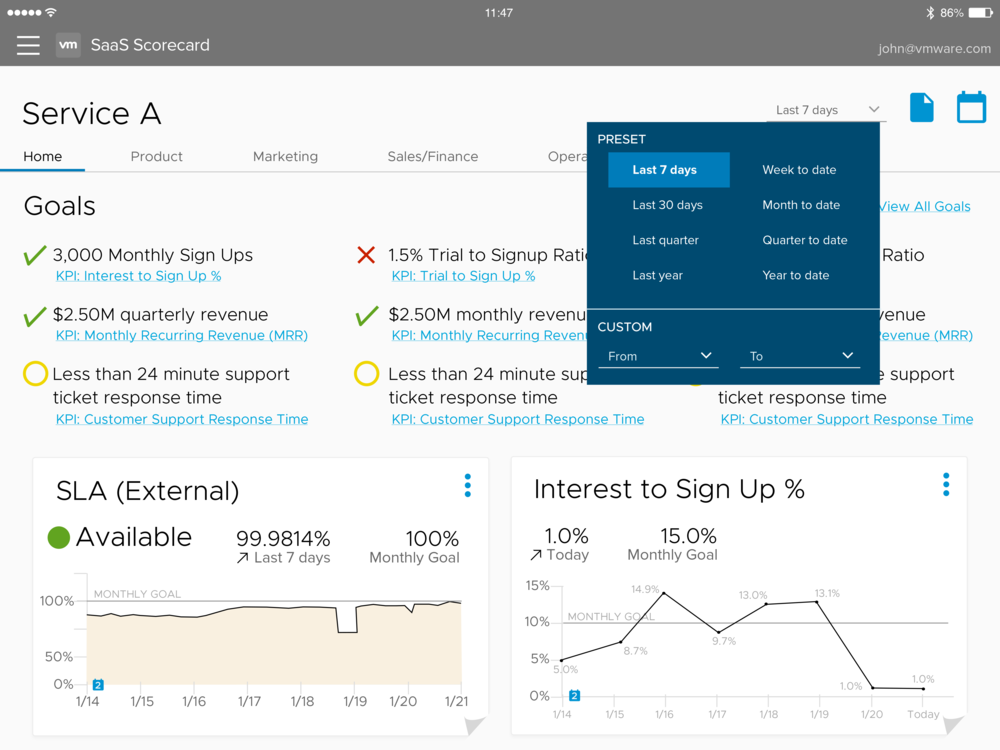

# Software as a Service (SaaS) Analytics

My firm was approached by a public cloud computing company to design the UX framework and information architecture for a SaaS key performance indicator (KPI) dashboard for executives on-the-go.

Our team of 2, myself and a UX engineer, began with a research phase to uncover technical requirements and review of previous work executed by an client intern. As lead designer and project manager, I maintained an open line of communication with my client and stakeholder groups to keep a pulse on evolving executive-level decisions impacting the project’s priorities.

## Conceptual Models and Reviews
We developed conceptual models after reviewing prior intern research, stakeholder interviews and competitor analysis of similar KPI tracking products. With our client, we selected a conceptual model that could be launched in the short-term — while still preparing for a more desirable, long-term vision.

Focusing on three prioritized KPIs, I developed multiple sketches for each metric’s overview state and drill-down detail state. The UX engineer and I examined these sketches to validate implementation. This enabled me to save time during more detailed wireframing because we had already tackled the big technical questions related to the capabilities of the data viz libraries.

## High-Fidelity Wireframes
With client approval and some technical validation, I increased the concept fidelity regarding navigation and card component. The project was paused because the design process was moving more quickly than the business could answer surfacing strategic questions, so I created a clickable, tablet-friendly Invision prototype to document our direction and decisions.

